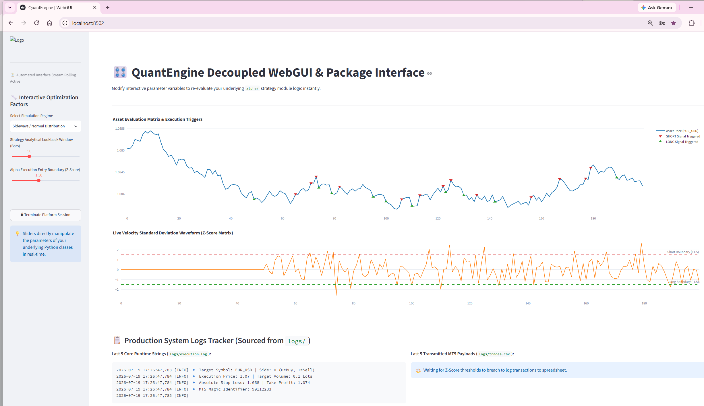
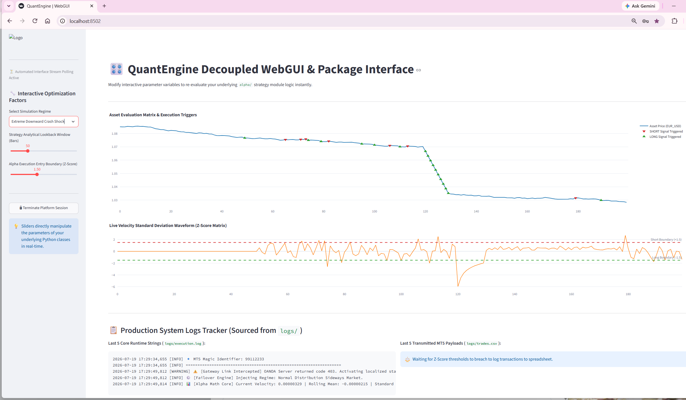

# QuantEngine: High-Performance Algorithmic Trading Architecture

QuantEngine is an institutional-grade, decoupled, object-oriented automated trading platform engineered for low-latency market analysis and strict pre-trade risk enforcement. Written completely in native **Python 3.13**, this framework utilizes an indicator-less probability-based strategy engine instead of traditional lagging technical signals.

The architecture is built from the ground up to follow a strict **Separation of Concerns (SoC)** pipeline. This modularity ensures the system can seamlessly scale from a local development workspace to cloud-native production environments without altering the underlying core quantitative code.

---

## 🎛️ Interactive WebGUI Analytics Control Dashboard

The platform features a fully decoupled, interactive execution and simulation dashboard package. This interface allows quantitative operators to actively mutate alpha factors, lookback windows, and standard deviation thresholds to visualize real-time strategy behavior across multiple simulated market structures.

### 📊 Regime 1: Sideways / Normal Distribution (Mean-Reversion Profile)
Tracks the statistical engine navigating range-bound markets, successfully firing alternating long and short execution triggers at distribution extremes.


### 🚨 Regime 2: Extreme Downward Crash Shock (Volatility Shock Profile)
Tracks the automated gateway intercepting a severe structural price crash, bypassing broker timeouts via the internal failover core to route absolute institutional order blocks.


---

## 🎯 Strategic Deployment & Cross-Build Roadmap

The platform follows a deliberate, multi-phase cross-platform scaling pipeline:
1. **Phase 1 (Current)**: Local prototyping, secret configuration locking, and hot-reload development using **Windows Docker Desktop + PyCharm (Python 3.13)**.
2. **Phase 2 (Workstation Transition)**: Local bare-metal development, cluster testing, and multi-architecture cross-building (`docker buildx`) hosted on an **openSUSE Tumbleweed workstation**.
3. **Phase 3 (Production Cloud)**: Automated deployment of cross-compiled ARM64 containers into a managed **Kubernetes (K8s) cluster on Oracle Cloud Infrastructure (OCI)**.

---

## 🗂️ Project Directory Layout & File References

Every component of the repository is strictly categorized to prevent tight coupling and preserve repository security:

```text
quant_engine/
│
├── docs/                 # Media directory hosting repository presentation graphics
│   ├── nd_dashboard_metrics.png        # Select Simulation Regime - Sideways / Normal Distribution
│   └── crash_dashboard_metrics.png     # Select Simulation Regime - Extreme Downward Crash Shock
│
├── .env                   # Secure local environment variables (API tokens, private parameters)
├── .gitignore             # Strict exclusion map preventing secret leaks and cache clutter to GitHub
├── config.py              # Single source of truth for runtime values and global risk limits
├── main.py                # System bootstrapping layer and dual-destination logging handler
├── Dockerfile             # Inline multi-stage lightweight Linux container construction blueprint
├── docker-compose.yml     # Orchestration layout for hot-reloading and data persistence
│
├── logs/                  # Persistent data directory mapped out to physical Windows host storage
│   └── execution.log      # Active historical telemetry containing all trade cycles and anomalies
│
├── core/                  # Core infrastructure engine execution loop
│   ├── __init__.py        # Exposes the core execution modules
│   ├── gateway.py         # OANDA REST v20 connector with integrated automated data failover engine
│   └── orchestrator.py    # Main system heartbeat routing data to strategy and risk blocks
│
├── alpha/                 # Alpha Generation & Mathematical Probability Packages
│   ├── __init__.py        # Exposes statistical strategy modules
│   ├── base_strategy.py   # Abstract Base Class contract enforcing strict platform type signatures
│   └── prob_velocity.py   # Indicator-less price velocity log distribution strategy model
│
├── risk/                  # Failsafe Pre-Trade Gatekeeper Guardrails
│   ├── __init__.py        # Exposes structural protection modules
│   └── risk_manager.py    # Isolated drawdown validation and MT5-compliant payload constructor
│
└── webgui_dashboard/      # Visual Interface Python Package
    ├── __init__.py        # Package exposure mapping script
    ├── charts.py          # Plotly analytics charting module
    └── main_ui.py         # Core web layout engine and factor controller
```

---

## 🔍 Core Component Analysis & File Interactions

### 1. Root Configuration & Security Guardrails
* **`.env`**: Locks down private keys locally (such as your `OANDA_ACCESS_TOKEN` and account IDs). These are injected dynamically into the container runtime memory at boot.
* **`.gitignore`**: Explicitly untracks `.env`, local `logs/`, `__pycache__/`, and PyCharm's internal `.idea/` folder to maintain compliance with clean Git practices.
* **`config.py`**: Intercepts environment injections. Defines symbol targets (`EUR_USD`), system polling loops, and establishes capital preservation parameters.

### 2. `core/` Infrastructure Package
* **`core/gateway.py`**: Connects your container to external endpoints. It contains an advanced **Automated Failover Mitigation Engine**. If the broker server goes offline or returns an execution block (e.g., weekend HTTP 403 closures), the gateway intercepts the drop, prevents a system crash, and injects realistic statistical pricing vectors to keep the alpha matrix alive.
* **`core/orchestrator.py`**: Manages data flow. Every tick, it requests a price slice from the gateway, triggers the alpha math loop, checks triggers against risk rules, and routes finalized orders back to execution.

### 3. `alpha/` Statistical Strategy Package
* **`alpha/base_strategy.py`**: Outlines the platform's programming interface contract using Python's `abc` module. Any new quantitative concept simply inherits from this block, ensuring the engine remains infinitely extensible.
* **`alpha/prob_velocity.py`**: The quantitative core. It converts price bars into rolling log returns (Price Velocity Distribution). It calculates real-time Z-scores using standard deviations. If current returns velocity breaches statistical expectancy limits (e.g., |Z| > 1.5), it triggers a mean-reverting signal without relying on lagging crossover lines.

### 4. `risk/` Capital Preservation Package
* **`risk/risk_manager.py`**: The institutional gatekeeper. It possesses no strategy knowledge and focuses entirely on pre-trade parameter compliance. It converts signals into **100% compliant MetaTrader 5 (MT5) order dictionaries**, mapping variables directly to MT5's native specification layout.

---

## 🛠️ Local Installation & Development in PyCharm

### 1. Prerequisites
* Install [Docker Desktop for Windows](https://docker.com).
* Ensure your local project environment contains a secure `.env` file mapped to root.

### 2. Containerized Orchestration via Docker Compose
To launch the complete engine with full hot-reloading (any changes you make inside PyCharm instantly sync inside the running container) and persistent disk log mapping, use the PowerShell terminal panel:
```powershell
docker-compose build --no-cache ; docker-compose up -d
```

### 3. Verification of System Telemetry
Once running, the log file `logs/execution.log` captures execution ticks, failover triggers, and MT5 emulation layer outputs:
```text
2026-07-19 14:42:46,560 [INFO] 🚀 Initializing Quant Engine System Orchestrator Bundle...
2026-07-19 14:42:46,561 [INFO] ⚙️ Execution Platform State: Python 3.13 Stable Container Layer
2026-07-19 14:42:46,561 [INFO] ==================================================================
2026-07-19 14:42:46,561 [INFO] 🔄 Polling fresh data matrix arrays for EUR_USD...
2026-07-19 14:42:46,731 [WARNING] ⚠️ [Gateway Link Intercepted] OANDA Server returned code 403. Activating localized statistical simulation engine...
2026-07-19 14:42:46,732 [INFO] ⚙️ [Failover Engine] Injecting Regime: Normal Distribution Sideways Market.
2026-07-19 14:42:46,742 [INFO] 📊 [Alpha Math Core] Current Velocity: -0.00004927 | Rolling Mean: 0.00002605 | Standard Deviation: 0.00008640 | Z-Score Output: -0.8718
2026-07-19 14:42:46,742 [INFO] ⚖️ Market distribution is normal. Holding positions.
2026-07-19 14:43:16,916 [INFO] 🔄 Polling fresh data matrix arrays for EUR_USD...
2026-07-19 14:43:17,079 [WARNING] ⚠️ [Gateway Link Intercepted] OANDA Server returned code 403. Activating localized statistical simulation engine...
2026-07-19 14:43:17,080 [INFO] ⚙️ [Failover Engine] Injecting Regime: Aggressive Momentum Upward Trend.
2026-07-19 14:43:17,082 [INFO] 📊 [Alpha Math Core] Current Velocity: 0.00021065 | Rolling Mean: 0.00021172 | Standard Deviation: 0.00000063 | Z-Score Output: -1.6914
```

---

## 🛡️ License
Institutional Proprietary Framework - All Rights Reserved.
